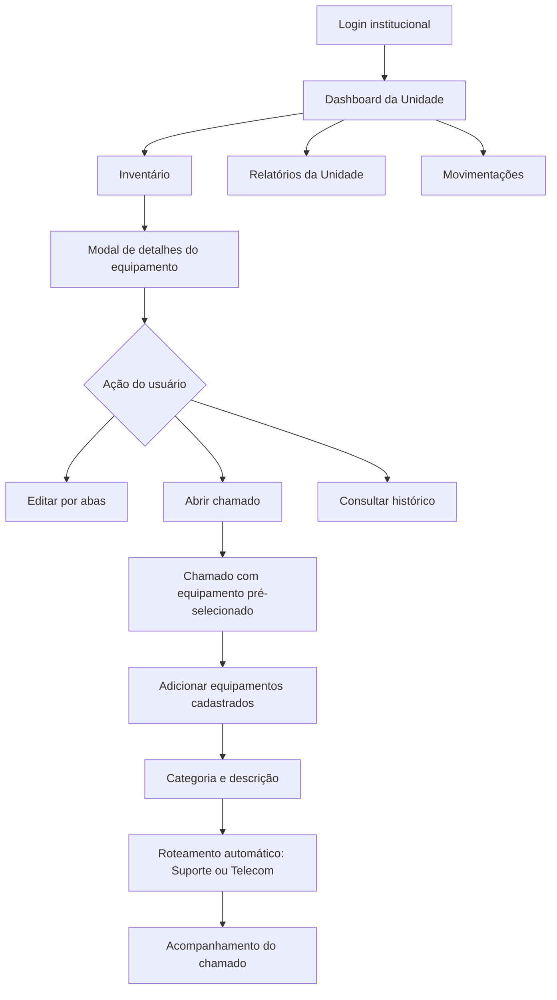

# Design da Experiência da DITEL — SIGAT

> **Documento de referência do produto**  
> Registro consolidado das decisões de UX/UI da **DITEL**, incluindo sua relação operacional com as Unidades.

<p align="center">
  <strong>SIGAT</strong><br>
  Sistema Integrado de Gestão de Ativos e Tecnologia
</p>

---

| Documento | Design da Experiência da DITEL |
|---|---|
| Produto | SIGAT — PMPA |
| Público principal | Administradores DITEL |
| Status | Design validado em nível conceitual |
| Data | 22 de agosto de 2026 |
| Escopo | Frontend e experiência de uso |
| Natureza | Documento de referência; não é implementação |

## Como usar este documento

Este arquivo funciona como a fonte de memória das decisões tomadas durante o planejamento inicial do frontend. Ele deve orientar wireframes, componentes, arquitetura de telas e critérios de validação visual.

As decisões estão separadas em três estados:

- **Definido:** aprovado durante o planejamento;
- **Diretriz:** princípio que deve orientar as decisões seguintes;
- **Provisório:** sujeito a revisão quando outros módulos forem detalhados.

> **Regra de produto**  
> O dashboard da Unidade deve responder primeiro: **“Qual é a situação dos equipamentos sob responsabilidade desta Unidade?”**

## Sumário

1. [Visão da experiência](#1-visão-da-experiência)
2. [Dashboard da Unidade](#2-dashboard-da-unidade)
3. [Inventário](#3-inventário)
4. [Chamados](#4-chamados)
5. [Experiência da DITEL](#experiência-da-ditel)
6. [Navegação e escopo](#6-navegação-e-escopo)
7. [Responsividade](#7-responsividade)
8. [Autenticação](#8-autenticação)
9. [Mapa da experiência](#9-mapa-da-experiência)
10. [Pontos provisórios](#10-pontos-provisórios)

---

## 1. Visão da experiência

### Direção visual

| Aspecto | Decisão |
|---|---|
| Personalidade | Institucional contemporânea |
| Identidade | Própria, derivada das referências visuais da PMPA |
| Densidade | Flexível: confortável por padrão, compactável para rotinas operacionais |
| Navegação | Híbrida: menu lateral + navegação contextual |
| Plataforma prioritária | Desktop |
| Adaptação | Responsiva para tablets e celulares |

### Princípios de design

1. **Inventário antes de tarefas:** o estado dos equipamentos é o centro da experiência da Unidade.
2. **Contexto sempre visível:** o usuário deve saber qual Unidade e qual escopo está consultando.
3. **Ações com consequência clara:** alterações críticas exigem confirmação explícita.
4. **Rastreabilidade por padrão:** alterações relevantes devem aparecer no histórico e na auditoria.
5. **Progressividade:** formulários longos são divididos em etapas ou abas.
6. **Informação acionável:** gráficos, filtros e alertas devem ajudar o usuário a decidir o próximo passo.

---

## 2. Dashboard da Unidade

O dashboard é um panorama operacional dos equipamentos da própria Unidade. Chamados, manutenções e pendências aparecem relacionados ao inventário, como camadas de atenção.

### Hierarquia da tela

```text
┌──────────────────────────────────────────────────────────┐
│ Unidade ativa · usuário · perfil · sair                  │
├──────────────────────────────────────────────────────────┤
│ Resumo do inventário                                     │
│ Total · Ativos · Manutenção                              │
├──────────────────────────────────────────────────────────┤
│ Situações de atenção                                     │
│ Inativos · Perdidos · Baixados · Dados pendentes         │
├──────────────────────────────┬───────────────────────────┤
│ Distribuição por tipo         │ Distribuição por situação │
├──────────────────────────────┴───────────────────────────┤
│ Evolução das manutenções                                  │
├──────────────────────────────────────────────────────────┤
│ Equipamentos: Atenção | Todos · busca · filtros          │
└──────────────────────────────────────────────────────────┘
```

### Cards de resumo

**Linha principal**

- Total de equipamentos;
- Equipamentos ativos;
- Equipamentos em manutenção.

**Linha de atenção**

- Inativos;
- Perdidos;
- Baixados;
- Dados pendentes.

Os estados de atenção ficam separados para que o usuário não confunda situações operacionalmente diferentes.

### Gráficos definidos

- **Distribuição por tipo:** mostra a composição do inventário — por exemplo, rádios, computadores e impressoras;
- **Distribuição por situação:** mostra ativos, manutenção, inativos, perdidos e baixados;
- **Evolução das manutenções:** acompanha o comportamento das manutenções ao longo do tempo.

### Ações rápidas

- Cadastrar equipamento;
- Abrir chamado;
- Solicitar movimentação;
- Gerar relatório da Unidade.

### Atividade recente

Área para alterações, movimentações, chamados e atualizações recentes do inventário.

---

## 3. Inventário

### Tabela de equipamentos

A tabela terá dois modos alternáveis:

| Modo | Conteúdo |
|---|---|
| **Atenção** | Equipamentos em manutenção, inativos, perdidos, baixados ou com dados pendentes |
| **Todos os equipamentos** | Inventário completo da Unidade |

Colunas de referência:

- Patrimônio;
- Tipo;
- Marca e modelo;
- Situação;
- Localização ou responsável;
- Última atualização;
- Ação para consultar detalhes.

### Busca e filtros

A busca principal será orientada por:

- Tipo;
- Modelo.

Filtros avançados:

- Patrimônio;
- Número de série;
- Situação;
- Marca;
- Período de cadastro;
- Manutenção;
- Garantia.

### Detalhes do equipamento

Ao selecionar um item, será aberta uma **modal ampla**, quase ocupando toda a tela, com conteúdo equivalente a uma página completa. O usuário permanece no contexto da listagem ou do dashboard.

#### Organização adaptativa

- Seções verticais quando o conteúdo for curto;
- Abas quando houver muitas informações;
- Modal em tela inteira em dispositivos menores.

Abas previstas:

- Resumo;
- Dados técnicos;
- Manutenção;
- Histórico;
- Chamados;
- Anexos e documentos.

### Cadastro de equipamento

O cadastro será um fluxo guiado em quatro etapas:

| Etapa | Conteúdo |
|---|---|
| 1. Identificação | Tipo, patrimônio, número de série e Unidade responsável |
| 2. Características | Marca, modelo e informações técnicas pertinentes |
| 3. Situação e garantia | Situação atual e informações de garantia |
| 4. Revisão e conclusão | Resumo, alertas, anexos e confirmação |

Regras de experiência:

- O usuário pode voltar às etapas anteriores sem perder dados;
- A Unidade responsável é determinada pelo sistema e fica bloqueada;
- Campos obrigatórios são validados progressivamente;
- O sistema verifica possíveis duplicidades de patrimônio e número de série;
- A etapa final permite revisar tudo antes de salvar.

### Edição de equipamento

Equipamentos existentes serão editados diretamente por abas:

- Identificação;
- Características;
- Situação e garantia;
- Anexos;
- Histórico.

Haverá um único botão **Salvar alterações** para toda a janela. O sistema validará todas as abas antes de concluir.

Alterações sensíveis exigem confirmação adicional, com explicação do impacto:

- Situação do equipamento;
- Patrimônio;
- Número de série;
- Baixa ou inativação;
- Unidade responsável, quando a ação for permitida à DITEL.

Histórico e auditoria são somente para consulta. A Unidade não pode alterar o vínculo da Unidade responsável.

---

## 4. Chamados

### Abertura a partir do Inventário

O usuário pode abrir um chamado pela janela de detalhes do equipamento. O sistema:

1. Redireciona para o módulo Chamados;
2. Mantém o equipamento de origem já selecionado;
3. Permite adicionar outros equipamentos já cadastrados da própria Unidade;
4. Mostra uma lista revisável antes do envio;
5. Valida o escopo dos equipamentos no backend.

A lista revisável exibe tipo, modelo e patrimônio, com ações para adicionar ou remover itens.

### Formulário do chamado

| Campo | Regra |
|---|---|
| Categoria | Seleção padronizada |
| Descrição | Relato detalhado do problema |
| Equipamentos | Um ou mais equipamentos cadastrados |
| Anexos | Documentos e fotos |
| Prioridade | Escolhida inicialmente pela Unidade |
| Seção responsável | Definida automaticamente pelo sistema |

Categorias:

- Falha;
- Dano;
- Manutenção preventiva;
- Solicitação técnica;
- Outro.

Prioridades:

- Baixa;
- Média;
- Alta;
- Crítica.

### Roteamento automático

O usuário **não escolhe** entre Suporte e Telecom. O sistema identifica a seção responsável a partir do problema selecionado.

| Seção | Responsabilidade |
|---|---|
| **Suporte** | Manutenção de equipamentos eletrônicos e suporte técnico |
| **Telecom** | Internet, rádios, manutenção de rádios, antenas, áreas de sombra e assuntos relacionados |

A seção fica visível no chamado, mas não pode ser alterada pela Unidade. O filtro Suporte/Telecom existe apenas para consulta na tabela.

A categoria **Outro** é encaminhada inicialmente para uma triagem geral da DITEL.

### Estados do chamado

```text
Aberto → Em análise → Em atendimento → Resolvido → Encerrado
              │              │             │
              └──────────────┴─────────────┴→ Aguardando informações

Qualquer estado permitido pela regra do sistema → Cancelado
Resolvido → Reaberto, com confirmação e nova prioridade
```

Estados definidos:

- Aberto;
- Em análise;
- Aguardando informações;
- Em atendimento;
- Resolvido;
- Encerrado;
- Cancelado.

### Reabertura

Um chamado **Resolvido** poderá ser reaberto mediante:

- confirmação adicional;
- motivo da reabertura;
- revisão obrigatória da prioridade;
- registro no histórico e na auditoria.

Chamados **Encerrados** são definitivos. Se o problema retornar depois do encerramento, será necessário abrir um novo chamado.

### Detalhes do chamado

A tela de detalhes será uma modal ampla, com estado, prioridade e seção responsável sempre visíveis no topo.

Abas:

- **Resumo:** descrição, anexos e fotos;
- **Equipamentos:** itens relacionados;
- **Histórico:** alterações, comentários e mudanças de estado.

Não haverá uma aba exclusiva para anexos.

---

## Experiência da DITEL

A DITEL utilizará a mesma base visual e estrutural da Unidade. A diferença será de escopo, permissões, filtros e ações administrativas; não haverá uma interface visualmente desconectada.

### Dashboard estadual

O dashboard abrirá com visão de todo o Estado e permitirá filtrar por:

- Unidade;
- município;
- região;
- tipo de equipamento;
- situação;
- seção responsável;
- período.

Cards estaduais separados:

- Total de equipamentos;
- Unidades ativas;
- Equipamentos em manutenção;
- Chamados críticos;
- Movimentações pendentes.

Os indicadores de manutenção são apenas informações de situação do inventário. O SIGAT não gerenciará manutenções detalhadas.

### Usuários e permissões

A listagem terá busca por matrícula ou nome e filtros por Unidade, perfil e situação. A DITEL poderá visualizar, criar, editar, bloquear e desativar usuários.

Perfis iniciais:

| Perfil | Escopo |
|---|---|
| **Administrador DITEL** | Escopo estadual e administração dos módulos permitidos |
| **Usuário da Unidade** | Escopo restrito à própria Unidade |

No cadastro:

- a Unidade será obrigatória para usuários vinculados a uma Unidade;
- o perfil definirá o escopo de acesso;
- o usuário não poderá alterar o próprio perfil ou vínculo;
- mudanças de perfil e Unidade serão auditadas.

A tela de detalhes do usuário será uma modal ampla com abas de dados institucionais, acesso e perfil, Unidade vinculada, histórico e atividade/auditoria.

### Unidades

A listagem de Unidades exibirá nome, sigla, código, município, região, quantidade de equipamentos, chamados abertos, situação e última atualização.

Filtros principais:

- município;
- região;
- situação;
- volume de equipamentos;
- chamados pendentes.

A modal de detalhes terá resumo, inventário, chamados, usuários vinculados e histórico administrativo.

### Inventário estadual

O Inventário da DITEL abrirá inicialmente com **todos os equipamentos do Estado**. A tela terá filtros por Unidade, município, região, tipo e situação, além de busca por patrimônio, número de série, marca e modelo.

Também haverá alternância para equipamentos em atenção, ações administrativas, exportação, relatórios e auditoria.

A DITEL utilizará a mesma modal ampla de detalhes e edição da Unidade, com campos e ações administrativas adicionais. A alteração da Unidade responsável ocorrerá exclusivamente pelo módulo Movimentações.

### Chamados estaduais

A tabela da DITEL abrirá inicialmente com chamados **abertos e pendentes de atendimento**. Poderá alternar para todos, resolvidos, encerrados, cancelados, por seção ou por Unidade.

A DITEL poderá, durante a triagem:

- corrigir a categoria;
- corrigir a seção Suporte/Telecom;
- ajustar a prioridade;
- alterar o estado conforme o fluxo;
- registrar todas as mudanças no histórico e na auditoria.

### Movimentações

Tipos definidos:

- transferência definitiva;
- movimentação temporária;
- retorno.

O fluxo é: solicitação, análise da DITEL, aprovação ou rejeição, atualização do vínculo após aprovação e registro completo.

A fila fica dentro do módulo Movimentações, sem card no dashboard. A rejeição exige justificativa obrigatória. Aprovação e rejeição exigem confirmação adicional.

A tela de detalhes será uma modal ampla com abas de resumo, equipamento, origem e destino, histórico e aprovação.

### Relatórios

Unidades verão apenas seus próprios dados. A DITEL poderá gerar relatórios estaduais e filtrar por Unidade, município e região.

O fluxo será:

1. escolher o relatório;
2. aplicar filtros;
3. gerar prévia;
4. revisar o conteúdo;
5. exportar somente após a conferência.

O formato inicial será **PDF**, com título, filtros, escopo, período, data, usuário e total de registros. O relatório terá área reservada para o brasão ou logotipo da PMPA. O modelo visual definitivo será definido posteriormente a partir de referência fornecida pelo Product Owner.

### Auditoria

A Auditoria será exclusiva da DITEL, somente para consulta e sem exclusão de registros. Abrirá com eventos recentes, do mais novo para o mais antigo.

Campos e filtros:

- data e hora;
- usuário;
- ação;
- módulo;
- entidade afetada;
- Unidade relacionada;
- resultado;
- período, usuário, módulo, ação e Unidade como filtros.

A tela de detalhes exibirá o evento completo, incluindo valores anteriores e novos quando aplicável. Relatórios de auditoria poderão ser exportados em PDF.

### Fora do SIGAT

Os módulos **Manutenção** e **Missões técnicas** já existem em outro sistema e não serão duplicados no SIGAT. Não haverá opções específicas desses módulos na navegação do SIGAT.

O SIGAT poderá exibir situações relacionadas no inventário ou no contexto de chamados, mas não gerenciará seus fluxos próprios.

## 6. Navegação e escopo

### Menu provisório da Unidade

- Dashboard;
- Inventário;
- Chamados;
- Movimentações;
- Relatórios;
- Perfil e configurações.

Por enquanto, Manutenção não será um módulo independente para a Unidade. Ela será acompanhada por meio dos chamados e das informações do inventário.

### Contexto permanente

O topo da aplicação deve exibir permanentemente:

- Nome e sigla da Unidade;
- Usuário autenticado;
- Perfil de acesso;
- Indicador visual do escopo atual;
- Ação **Sair**.

Após o login, o usuário será direcionado diretamente ao Dashboard da própria Unidade.

---

## 7. Responsividade

O SIGAT será pensado principalmente para computadores, mas será responsivo o suficiente para tablets e celulares.

| Dispositivo | Prioridade de uso |
|---|---|
| Desktop | Experiência completa: tabelas, gráficos, menu lateral, cadastro e edição |
| Tablet | Menu recolhível, painéis reorganizados e tabelas adaptadas |
| Celular | Consulta rápida, alertas, chamados e ações essenciais |

Diretrizes:

- Cadastro e edição completos de equipamentos são prioritariamente realizados em computadores;
- Abertura e acompanhamento de chamados funcionam em tablets e celulares;
- Tabelas extensas podem virar cartões ou usar rolagem controlada;
- Modais amplas podem ocupar a tela inteira em dispositivos menores.

---

## 8. Autenticação

### Tela de login

A tela terá composição institucional em layout dividido:

- painel institucional com identidade visual do SIGAT e referência à PMPA;
- painel de acesso com o formulário;
- reorganização vertical em telas menores.

O acesso será feito por **matrícula + senha**. O e-mail institucional será usado para recuperação e notificações, não como identificador principal.

### Recuperação de senha

1. Usuário seleciona **Esqueci minha senha**;
2. informa a matrícula;
3. o sistema mostra uma mensagem genérica, sem confirmar se a matrícula existe;
4. envia código ou link temporário para o e-mail institucional cadastrado;
5. usuário define nova senha;
6. sessões anteriores são invalidadas;
7. alteração é registrada.

O código ou link deve ser de uso único, ter prazo curto e limite de tentativas. Sem e-mail cadastrado, a recuperação será feita pela administração da DITEL.

### Tentativas incorretas

- A conta não será bloqueada;
- novas tentativas serão permitidas;
- haverá limite de requisições contra automação abusiva;
- tentativas relevantes serão registradas na auditoria;
- mensagens de erro serão genéricas.

### Sessão

A sessão permanecerá ativa até o usuário clicar em **Sair**.

O logout deverá:

- invalidar a sessão;
- remover a exposição de dados sensíveis da interface;
- impedir o retorno à área autenticada sem novo acesso.

> **Risco residual registrado**  
> Uma sessão sem expiração por inatividade pode permanecer aberta em um computador compartilhado. A interface deve tornar o logout evidente e acessível.

---

## 9. Mapa da experiência



## 10. Pontos provisórios e próximos passos

Os itens abaixo ainda não foram definidos completamente:

- frameworks e bibliotecas do frontend;
- arquitetura de pastas e componentes;
- matriz completa de permissões;
- detalhes de Movimentações;
- detalhes de Relatórios;
- política completa de tokens e autenticação em dois fatores;
- regras definitivas de anexos, limites e formatos;
- estados e regras operacionais detalhadas do backend.

### Próxima etapa de planejamento

1. Revisar a navegação compartilhada entre perfis;
2. consolidar o design geral do produto;
3. escolher frameworks e bibliotecas do frontend;
4. criar o plano de implementação somente após a aprovação do design.

---

> **Nota de manutenção**  
> Este documento deve ser atualizado quando uma decisão for alterada. Novas decisões devem indicar claramente se substituem, complementam ou apenas refinam uma decisão anterior.
